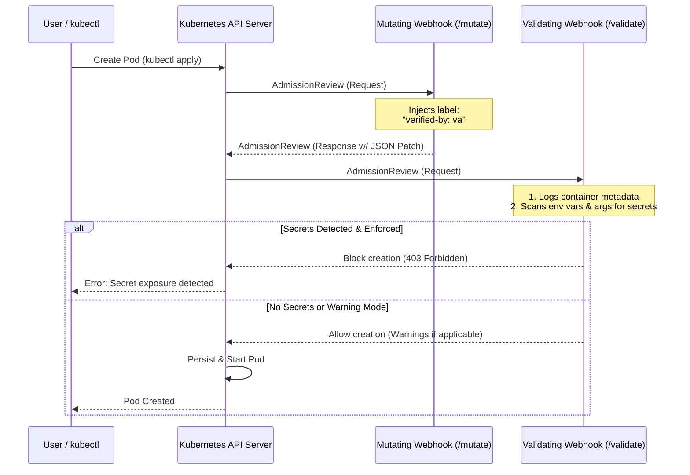

# Kubernetes Admission Controller: Secret Scanner & Label Mutator

This project is a Go-based Kubernetes Admission Controller designed to secure Pod deployments. It features:
1. **Mutating Admission Webhook (`/mutate`)**: Automatically injects a metadata label `verified-by: va` on every Pod creation request.
2. **Validating Admission Webhook (`/validate`)**: Analyzes the Pod specification before persistence. It logs container configurations (images, command/args, ports) and scans environment variables and CLI arguments for plaintext secrets (API keys, passwords, Slack webhooks, private keys, connection strings, etc.).

---

## Architecture Diagram



---

## Features

### Mutating Webhook
* **Label Injection**: Dynamically injects `verified-by: va` to Pod metadata.
* **Idempotency**: Safely handles cases where the Pod has no existing labels (initializes the map) or already has labels (adds to the map).

### Validating Webhook & Secret Scanner
* **Rule-based Scanning**: Detects specific API keys and tokens using standard patterns:
  * AWS Access Key IDs & Secret Keys
  * GitHub Personal Access Tokens (PATs)
  * Slack Webhook URLs
  * Private Keys (SSH, RSA, PGP, etc.)
  * Generic URLs containing basic authentication credentials
* **Keyword Heuristics**: Detects variables containing keywords like `PASSWORD`, `SECRET`, `TOKEN`, `KEY` which have plaintext values, warning the developer to use `SecretKeyRef` instead.
* **Structured Logging**: Outputs container runtime details (images, ports, environment variable names, etc.) during pod verification.
* **Block vs. Warning Modes**: Fully configurable to block the Pod deployment entirely, or allow it with warning messages returned to the CLI.

---

## Configuration

The webhook can be configured using environment variables in the deployment spec:

| Env Variable | Type | Default | Description |
| :--- | :--- | :--- | :--- |
| `ENFORCE_SECRETS_BLOCK` | boolean | `true` | When `true`, Pods exposing secrets in plaintext are blocked from creation. When `false`, Pods are created but warnings are shown. |
| `PORT` | string | `8443` | Port the Go HTTPS server listens on. |
| `TLS_CERT_FILE` | string | `/etc/webhook/certs/tls.crt` | Path to the x509 TLS certificate. |
| `TLS_KEY_FILE` | string | `/etc/webhook/certs/tls.key` | Path to the x509 private key. |

---

## Quick Start (Local Testing with Minikube / Kind)

### Prerequisites
* Go 1.26 or higher
* Docker
* A local Kubernetes cluster (Minikube or Kind)
* `kubectl` CLI

---

### Step 1: Run Local Tests
Verify the Go scanner and patch rules function correctly:
```bash
go test ./... -v
```

---

### Option A: Fully Automated Deployment (Recommended)
We provide a single script `deploy.sh` that automatically builds the container, detects your cluster type (Docker Desktop, Minikube, or Kind), generates certificates, registers K8s secrets, patches webhook configuration manifests, deploys them, and waits for a successful rollout.

Run:
```bash
./deploy.sh
```

---

### Option B: Manual Step-by-Step Deployment

#### Step 2: Build the Container Image
Point your terminal to your cluster's Docker daemon so Kubernetes can find the image locally:

**For Minikube:**
```bash
eval $(minikube docker-env)
docker build -t secret-scanner-webhook:latest .
```

**For Kind:**
```bash
docker build -t secret-scanner-webhook:latest .
kind load docker-image secret-scanner-webhook:latest
```

**For Docker Desktop:**
```bash
docker build -t secret-scanner-webhook:latest .
```

#### Step 3: Generate TLS Certificates
Kubernetes requires admission controllers to communicate exclusively over HTTPS. Run the certificate generation script to:
1. Create a self-signed CA and sign a certificate for the service DNS `secret-scanner-webhook-service.default.svc`.
2. Upload the credentials as a Kubernetes Secret named `secret-scanner-webhook-certs`.
3. Auto-patch the `caBundle` in `deploy/mutating-webhook.yaml` and `deploy/validating-webhook.yaml` with the generated CA.

```bash
./certs/generate-certs.sh
```

#### Step 4: Deploy the Webhook Server
Deploy the resources into the cluster:
```bash
kubectl apply -f deploy/deployment.yaml
kubectl apply -f deploy/service.yaml
kubectl apply -f deploy/mutating-webhook.yaml
kubectl apply -f deploy/validating-webhook.yaml
```

Verify that the webhook pod starts and is running:
```bash
kubectl get pods -w
```

---

### Step 5: Test the Admission Webhooks

Follow the logs of the webhook server:
```bash
kubectl logs -l app=secret-scanner-webhook -f
```

#### Test Case A: Create a Safe Pod
Deploy the safe pod config:
```bash
kubectl apply -f deploy/test-pod-safe.yaml
```
In the webhook logs, you will see the container details logged and the mutation confirmation:
```
Successfully mutated pod default/test-pod-safe. Injected 'verified-by: va' label.
Pod default/test-pod-safe passed secret scanning validation.
```

Verify that the label was successfully injected:
```bash
kubectl get pod test-pod-safe --show-labels
```
You should see the label `verified-by=va` in the output!

#### Test Case B: Create an Unsafe Pod
Deploy the unsafe pod containing credentials:
```bash
kubectl apply -f deploy/test-pod-unsafe.yaml
```
You should see an error message directly in your terminal, and the pod creation will be rejected:
```
Error from server (Forbidden): error when creating "deploy/test-pod.yaml": admission webhook "validate.secret-scanner.svc" denied the request: Pod creation blocked due to secret exposure: [app-container/EnvVar/DATABASE_URL] Connection string containing basic auth credentials (Value preview: post****mydb); [app-container/EnvVar/AWS_ACCESS_KEY_ID] AWS Access Key ID detected (Value preview: AKIA****MPLE); [app-container/EnvVar/GITHUB_PAT] GitHub Personal Access Token detected (Value preview: ghp_****wxyz); [app-container/EnvVar/JWT_SECRET] Sensitive environment variable 'JWT_SECRET' contains plaintext value. Use SecretReference instead. (Value preview: some****sure)
```
In the webhook logs, a warning will be logged detailing the vulnerabilities.

---

## Cleanup
To cleanly remove all deployed configurations, services, secrets, test pods, local certificates, and reset configurations, run:
```bash
./cleanup.sh
```
